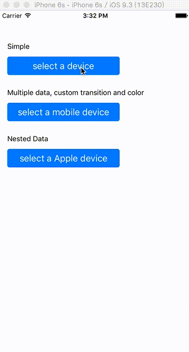

# UPicker

A picker widget written in Swift. Easy to use and set a custom style if you need.

## Screenshot



## Installation

#### CocoaPods

```ruby
# for swift 4
pod "UPicker", '~>1.1.0'

# fot swift 3
pod "UPicker", '~>1.0.1'

# for swift 2.3
pod 'UPicker', '~>0.1.1'
```

#### Manual

Download `UPicker.swift` and `UPickerView.swift`, and add them into your project.

## Usage

### Simple

```swift
class ViewController: UIViewController {
    let picker: UPicker?
    let data = [["First", "Second", "Third"]]
    let selected = [0]
    // ...
    
    func showPicker() {
        if picker == nil {
            picker = UPicker(frame: view.frame, didDisappear: { selected in
                if rows != selected {
                    print("select \(rows[0])")
                }
            })
        }
        
        picker.pickerView.data = data
        picker.pickerView.selectedRows = selected
        picker?.present(self)
    }
}
```

### Multiple Data

You could use multiple data.

```swift
//...
picker.pickerView.data = [["First", "Second", "Third"], ["Fourth", "Fifth"]]
picker.pickerView.selectedRows = [0, 0]
//...
```

### Nested Data

In addition, nested data is available.

```swift
//...
picker.pickerView.data = [["Odd", "Even"]]
picker.pickerView.selectedRows = [0, 0]

// nested hierarchy
picker.pickerView.nestedHierarchy = 2
// nested data
picker.pickerView.nestedData = [
    "Odd": ["1", "3", "5", "7", "9"],
    "Even": ["2", "4", "6", "8"]
]

//...
```

### Custom Style

`UPicker` is a child class of `UIViewController`. You can set custom transition when the date picker show.
      
`UPicker.pickerView` is a instance of `UPickerView` that is a child class of `UIView`. And You can get some view from its properties

- pickerView: UIPickerView
- barView: UIView
- doneButton: UIButton
- blankView: UIView
    
Therefor, You can do anything what you want with them. 
    
For example:
    

```swift
// ...

// custom transition
picker.modalTransitionStyle = .FlipHorizontal

// custom button text
picker.pickerView.doneButton.setTitle("OK", forState: .Normal)

// custom picker view text color
picker.pickerView.textColor = UIColor.blueColor()

// ...
```